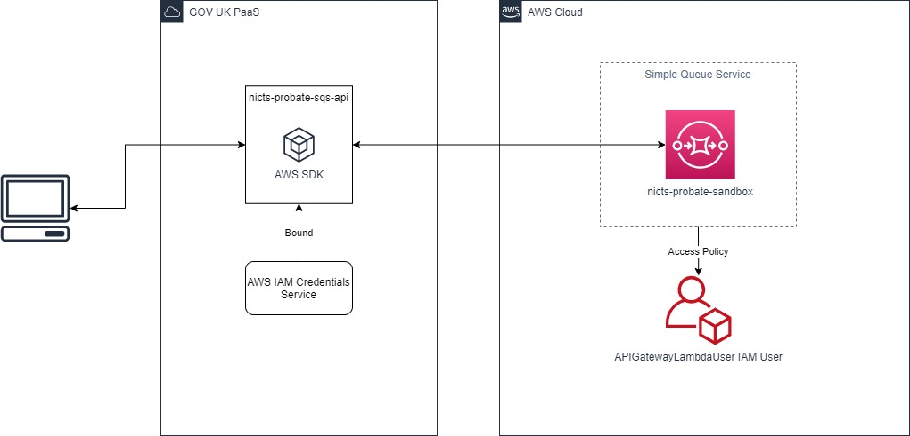

# NICTS Probate Simple Queue Service PoC

PoC to highlight how to integrate with Amazon SQS via GOV UK PaaS.

Application leverages SteelToe to pull in configuration that has been set on Cloud Foundry, specifically the AWS credentials for the user of SQS client. 

This is achieved by creating a user provided service on Cloud Foundry that is bound to this app. Credentials then become accessible to app via VCAP_SERVICES. These can be retrieved in Startup directly from Configuration object, or by injecting into services, see queue services.